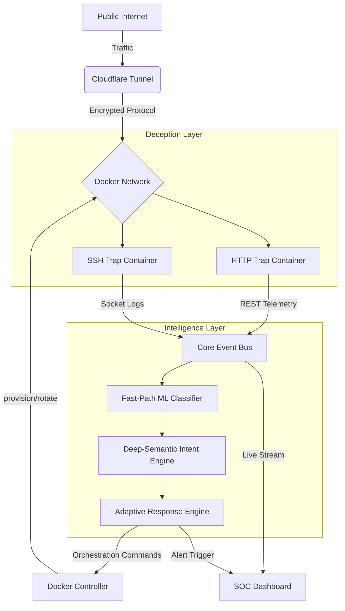
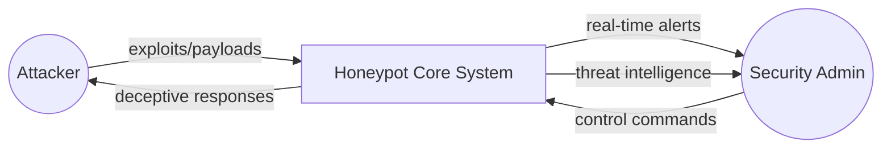
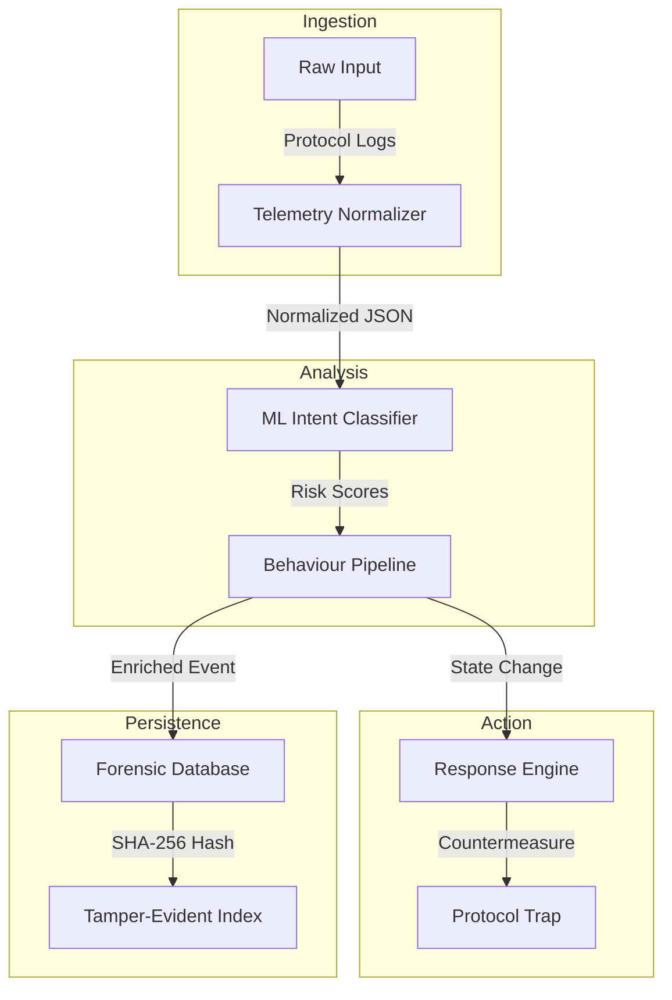
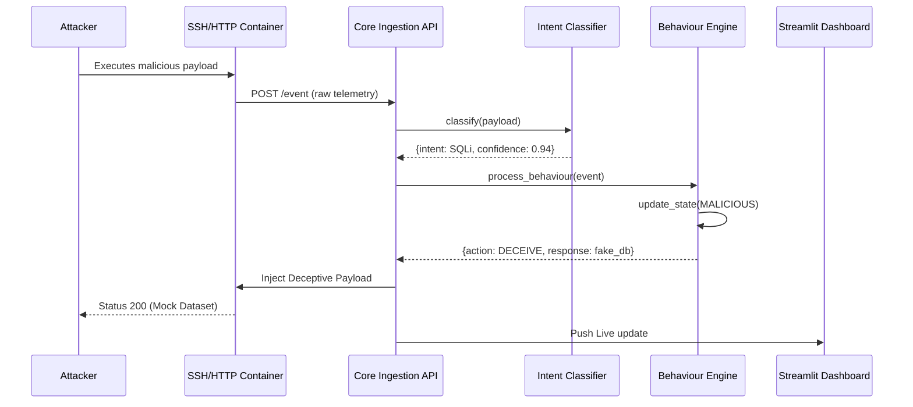
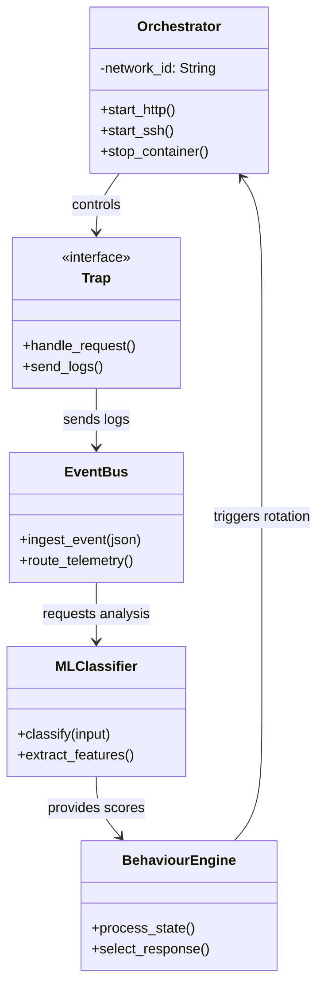
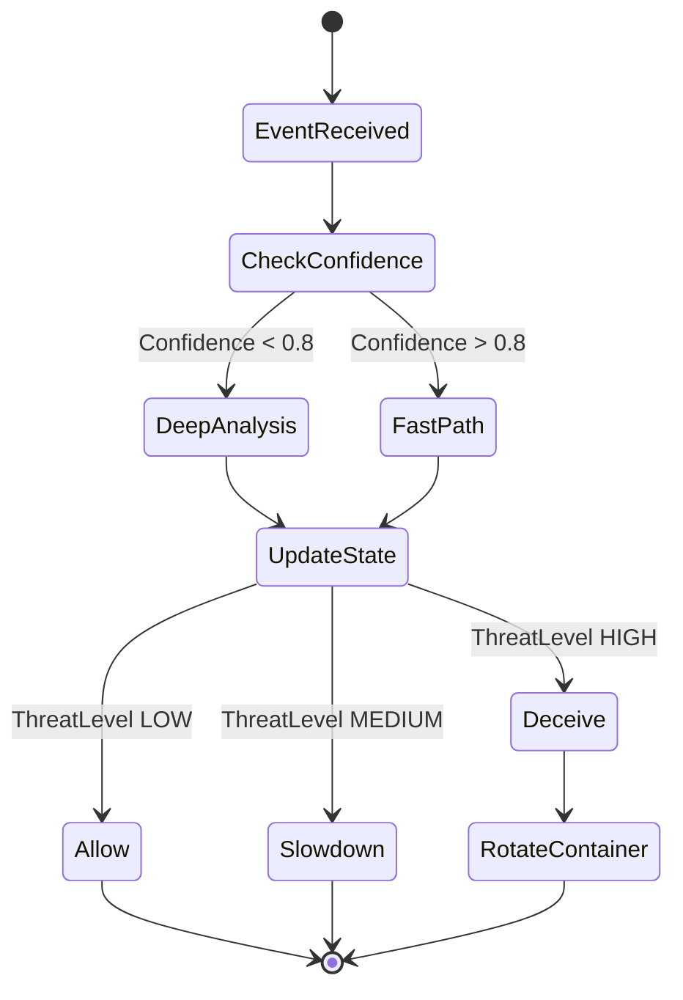
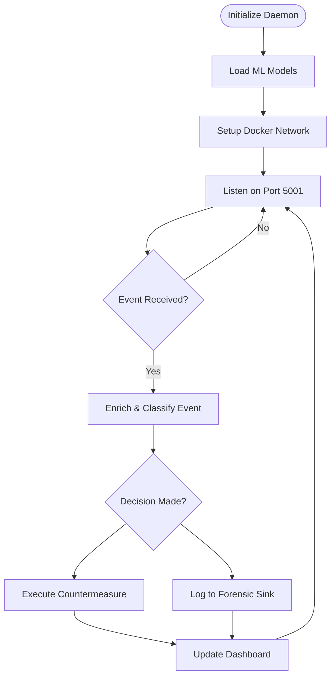

# Technical Diagrams: Behaviour-Aware Honeypot

This document contains the source code for 8 technical diagrams representing the architecture, data flow, and logic of the Behaviour-Aware Honeypot project. You can copy these code blocks into any Mermaid-compatible tool or use a [StarUML Mermaid Plugin](https://github.com/staruml/mermaid) to import them directly.

---

## 1. Architecture Diagram
Shows the high-level physical and logical components of the system.



---

## 2. DFD Level 1 (Context Diagram)
Defines the external entities and the primary system boundary.



---

## 3. DFD Level 2 (Detailed Data Flow)
Details the internal data processing from ingestion to storage.



---

## 4. Use Case Diagram
Maps actors to system functions.

```mermaid
useCaseDiagram
    actor Attacker
    actor "Security Analyst" as Analyst
    
    package HoneypotSystem {
        usecase "Interact with SSH/HTTP Traps" as UC1
        usecase "Trigger Deceptive Payloads" as UC2
        usecase "Analyse Real-time Telemetry" as UC3
        usecase "Orchestrate Docker Containers" as UC4
        usecase "Review Threat Reports" as UC5
    }
    
    Attacker --> UC1
    Attacker --> UC2
    Analyst --> UC3
    Analyst --> UC4
    Analyst --> UC5
```

---

## 5. Sequence Diagram
Illustrates the chronological order of messages during an attack.



---

## 6. Class Diagram
Defines the structural relationships of the Python implementation.



---

## 7. Activity Diagram
Visualizes the decision-making logic of the Response Engine.



---

## 8. System Flowchart
Represents the infinite operational loop of the backend service.


